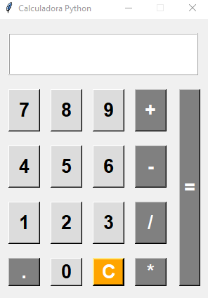

# Calculadora TkInter

## Calculadora simples, implementada com interface gráfica usando a biblioteca Tkinter, ambiente virtual Venv e linguagem de programação Python.

Tkinter: é a biblioteca padrão do Python para a criação de interfaces gráficas (GUI). Ela fornece um conjunto de widgets, como botões, rótulos, caixas de entrada, menus e muito mais, permitindo o desenvolvimento de aplicações desktop de maneira simples e eficiente.

Venv: ambiente virtual em Python isola dependências do projeto, evitando conflitos com pacotes globais do sistema. Ele permite que cada projeto tenha suas próprias bibliotecas e versões específicas.



## Ferramentas utilizadas:
* Linguagem de programação Python 3.9.13.
* Ambiente virtual VENV.
* Git/GitHub
* Visual studio code.
* Windows 10.

## Requisitos:
Certifique-se de ter os seguintes pacotes instalados antes de rodar o projeto:
* Python 3.x
* Tkinter

## Modo de utilizar: 
* Clonar repositório.
* Acessar o diretório ```'cd calculadora-tkinter-python```.
* Executar ```python -m venv venv``` para instalar o ambiente virtual.
* Executar, caso esteja no Windows, ```venv\Scripts\activate``` para iniciar o ambiente. Caso Linux ou MacOS, ```source venv/bin/activate```.
* Executar ```pip install -r requirements.txt``` para instalar as dependências.
* ```python app.py``` - Executa o algoritmo.
* Para sair do ambiente virtual ```deactivate```.

## Contribuição:
Se quiser contribuir para este projeto, fique à vontade para enviar um pull request ou relatar problemas na seção de issues.

## Licença:
Este projeto é licenciado sob a Licença MIT.